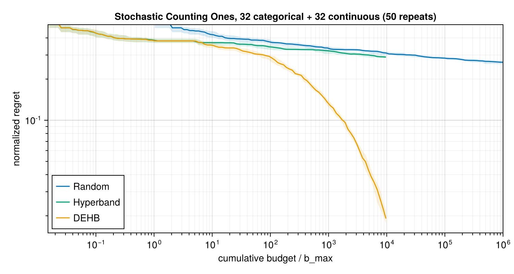

# BigHO

[](https://codecov.io/gh/dom-linkevicius/BigHO.jl)

## Introduction

BigHO.jl is a hyperparameter optimization library meant to be used in situations where individual function evaluations are costly. The package implements executors (which control how individual functions are evaluated) and samplers (which control how the hyperparameters are chosen), allowing for different composition of executors and samplers, depending on the optimization problem and available resources. The package is still under development and some of the features or implementations may change.

### Executors
The package implements three different executors, meant for different scenarios:
- `Serial`, which runs the sampler sequentially, mostly for development and testing purposes
- `Threaded`, which runs the sampler over the specified number of threads, meant for intermediate sized jobs
- `DistributedQueue` meant for the biggest jobs, usually on a compute cluster, running the sampler over different processes (one function evaluation per spawned process), requiring the specification of how those processes should be created (e.g. each process should have 12 threads).

### Samplers
The package currently implements the following samplers:
- `RandomSampler`, which selects the parameters randomly
- `LHSampler`, which is a Latin Hypercube sampler, aiming to maximally spread out `n` samples in the parameter space
- `Hyperband`, which runs brackets of trials, using a different number of resources to train them and promoting best trials within a bracket, until the bracket reaches its resource limit
- `ASHA`, which is the asynchronous version of Hyperband, also running brackets, but not requiring the completion of a bracket before trials are promoted
- `DEHB`, a modified version of `Hyperband` where, after the first bracket, trials are not simply promoted between rungs but undergo differential evolution and can reach a better ceiling on larger search spaces

## Convenience functionality

BigHO.jl provides some convenience functionality, such as
- tracking the status of individual trials, such that individual trial failures would not crash the whole optimization run, but should provide enough information to diagnose and reproduce them
- saving results after each `k` trials in a user specified directory, such that after unexpected crashes and failures it would be possible to easily resume an optimization run
- conversion of hyperparameter optimization results into a `DataFrames.DataFrame` for easier downstream analysis
- summary plotting (via a `CairoMakie` extension), showing scatter plots of the objective value against each hyperparameter (with marginal histograms), the objective value over trial id, and the best value found so far over trial id
- `Stateful` optimization functions, which allow continuation of training from a previous state in samplers such as `Hyperband` or `ASHA`, amortizing some of the optimization costs, as well as allowing saving of data of interest via the `post_artefact`

## Sample code

```julia
using BigHO
using DataFrames: DataFrame
using Random

# The objective receives all hyperparameters as one NamedTuple `p` -- the sampler's
# resource level is `p.r`. Bigger `p.r` means more noisy samples averaged together, so the
# estimate sharpens as more resource is spent. Wrapped in `Stateful`, so a trial promoted to
# a higher `p.r` only pays for the *extra* samples, continuing from `pre_artefact` instead of
# restarting from scratch.
function noisy_bowl(p; pre_artefact=nothing)
    p.x > 4.5 && error("simulated failure for x > 4.5 -- BigHO marks this a Failed trial and keeps going")
    n_done, total = pre_artefact === nothing ? (0, 0.0) : pre_artefact
    centre = p.kernel == "rbf" ? 3.0 : -1.0
    loss = (p.x - centre)^2 + (log10(p.lr) + 2.5)^2 + (p.degree - 3)^2
    n_new = p.r - n_done
    total += sum(loss + 0.5randn() for _ in 1:n_new)
    n_done += n_new
    return total / n_done, (n_done, total)
end

# Named, not a closure: checkpoints store functions by name, so an anonymous `u -> 10.0^u`
# would not survive a reload.
log_uniform(u) = 10.0^u

candidates = (
    x=Continuous(-5.0, 5.0),                       # uniform over [-5, 5]
    lr=Continuous(-4, -1; transform=log_uniform),  # log-uniform over [1e-4, 1e-1]
    degree=Ordinal([1, 2, 3, 4, 5]),               # ordered, so 2 lies between 1 and 3
    kernel=Nominal(["rbf", "linear"]),             # unordered, no level is "between" any other
)

# iterations=2 replays the whole bracket schedule twice: 4 brackets, 138 trials in total.
ho = Hyperoptimizer(Stateful(noisy_bowl), candidates, Hyperband(R=27, iterations=2))

# save_path/save_every checkpoint the run every 10 trials told -- after a crash, resume with
# `ho = load_hyperoptimizer(Stateful(noisy_bowl), "ho_checkpoint.jld2")`, then `run!` again.
run!(ho; executor=Threaded(), save_every=10, save_path="ho_checkpoint.jld2")

printmin(ho)     # best trial found so far
DataFrame(ho)    # every trial (including any Failed ones), with its parameters and value

using CairoMakie, AlgebraOfGraphics  # summaryplot needs both loaded to activate the extension
summaryplot(ho; figure_kwargs=(; size=(800, 400)))  # figure_kwargs/axis_kwargs/scatter_kwargs/histogram_kwargs/line_kwargs all pass through
```


## Internal benchmarking

To check that the samplers and executors actually deliver what they promise, the repo runs two benchmarks: an artificial toy function taken from the literature, where the optimum is known and the published results can be compared against, and a real neural-network hyperparameter search, where wall-clock time and executor behaviour matter.

### Stochastic Counting Ones

This toy benchmark comes from [Falkner et al. (2018)](https://arxiv.org/abs/1807.01774) and is used in §5.1 of the [DEHB paper](https://arxiv.org/abs/2105.09821). The objective is

$$f(x) = -\left(\sum_{x \in X_{cat}} x + \sum_{x \in X_{cont}} \mathbb{E}_b[B_{p=x}]\right)$$

over 32 binary and 32 continuous hyperparameters, where the resource `b` is the number of Bernoulli samples used to estimate each continuous variable's mean, so a low-resource evaluation is a noisy one. The schedule is `r_min=9`, `R=729`, `η=3`, which should match the paper, and regret is normalized as `(f(x) + d) / d` with `d = 64`, so 0 is the optimum and 1 the worst case.

Each sampler is run 50 times. The cumulative budget / b_max varies by sampler — `RandomSampler` gets 10⁶, `Hyperband` and `DEHB` get 10⁴.



This qualitatively reproduces Figure 6 of the DEHB paper. `DEHB` pulls away from the other two at around 10² and has dropped by more than an order of magnitude by 10⁴, while `RandomSampler` has barely improved even two decades of budget later, at 10⁶.

This package does not yet contain `BOHB`, so `Hyperband` was added as a stand-in, as until `BOHB` gets enough samples it acts like `Hyperband`. `Hyperband`, same as `BOHB` in Figure 6 of the DEHB paper, tracks `DEHB` early on, but contrary to `BOHB` it never separates from `RandomSampler` afterwards, because it has no equivalent of the Bayesian model that `BOHB` starts to exploit once it has enough observations. Cheap rungs alone buy little here — every configuration `Hyperband` promotes was still drawn using an inner `RandomSampler`, so it tracks random search. What separates `DEHB` is that its higher-resource subpopulations are evolved from configurations that already did well at lower resource, it uses a sampling method that is adaptive based on the performance of previous trials.

### Neural network hyperparameter search

The second benchmark trains a small MLP on the Titanic dataset (via `MLDatasets.jl`), minimizing validation loss over five hyperparameters: learning rate, number of dense layers, hidden width, activation, and L2 regularization strength.

The comparison is set up as "same budget, who gets there first":
- `Hyperband`, `ASHA` and `DEHB` run their own one-pass bracket schedule (`R=1215`, `η=3`, `r_min=5`, giving 6 brackets), where one resource unit is 6 training epochs — so a bottom-rung trial trains for 30 epochs and a top-rung one for 7290.
- That schedule tries 415 distinct hyperparameter configurations and spends ~205k epochs in total, so `RandomSampler` and `LHSampler` are given exactly the same: 415 trials, with their per-trial epoch count set so the totals match. No sampler gets more compute than another — only the choice of how to spend it differs.
- We use two different executors, `Serial` and `Threaded`, as the problem is not large enough to warrant a `DistributedQueue`.
- Every (sampler, executor) combination is repeated 20 times; the figure shows the median and interquartile range across those repeats.

"Regret" is a run's best-validation-loss-so-far minus the best loss seen across every run in the benchmark, since the true optimum of this problem is not known analytically.


What the figure shows:
- The successive halving-based samplers reach any given regret level sooner than the full-budget samplers at equal total budget, and they do so at every point in the run, in both executors. Cheap early rungs let them discard bad configurations before paying full price for them.
- `LHSampler` starts better than `RandomSampler` under `Serial` since the space-filling design covers the space sooner than independent draws would. The `LHSampler` advantage vanishes once both have drawn enough configurations.
- `Threaded` completes the same work several times faster than `Serial` (64 threads used): roughly 8x for `RandomSampler` and `LHSampler`, and roughly 3x for `Hyperband`, `ASHA` and `DEHB`. The full-budget samplers parallelize best because their trials are independent, whereas the successive-halving samplers have to resolve some trials before they can promote. `ASHA` finishes ahead of `Hyperband` under `Threaded` because it does not wait for a rung to complete fully.
- `DEHB` is the most expensive per repeat, roughly a third slower than the other successive-halving samplers, since only its first bracket promotes configurations unchanged — every later bracket evaluates a freshly evolved configuration that has to train from scratch.
- Unlike Counting Ones, the final regrets end up close together, within a small factor of each other. The search space here is small enough and the objective noisy enough that random draws find good configurations quickly, so the advantage of successive halving is mostly how fast it gets there rather than a much lower ceiling.

You can find the benchmarking code in [`benchmarks/`](benchmarks/).

## Provenance

- BigHO.jl started as a fork of, and was inspired by, [Hyperopt.jl](https://github.com/baggepinnen/Hyperopt.jl), but has since been rewritten essentially from the ground up to address some of the perceived limitations of that package.
- This package was written with significant assistance of Claude Code.
