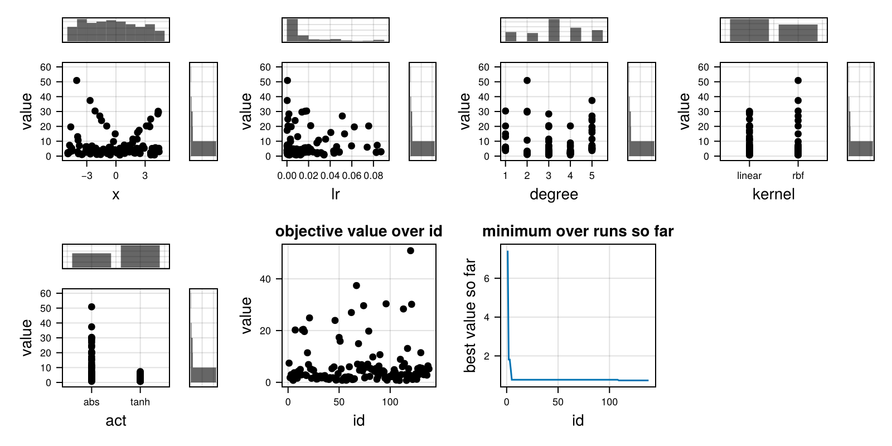
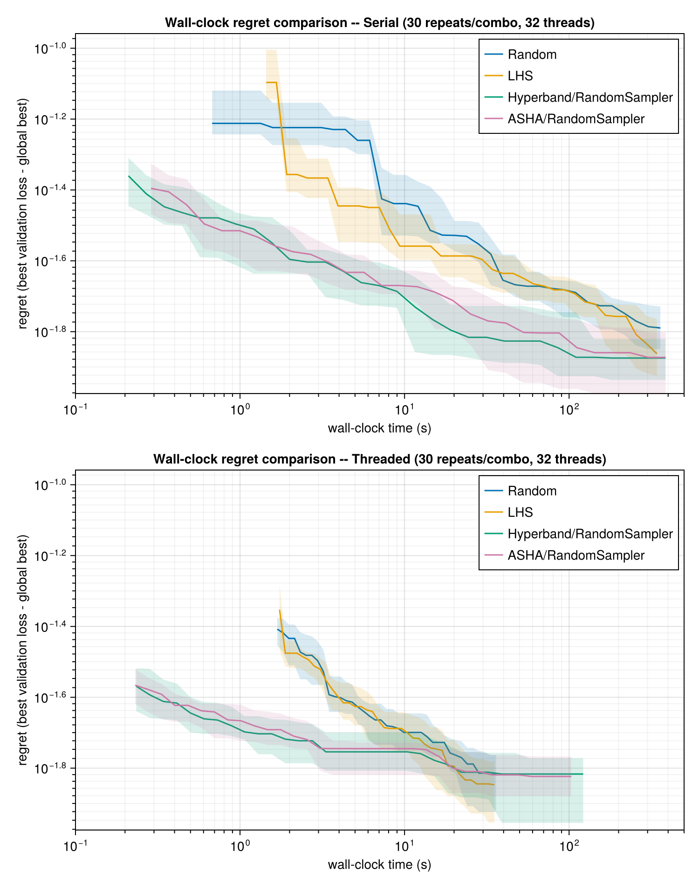

# BigHO

[](https://codecov.io/gh/dom-linkevicius/BigHO.jl)

## Introduction

BigHO.jl is a hyperparameter optimization library meant to be used in situation where individual function evaluations are costly. The package implements executors (which control how individual functions are evaluated) and samplers (how are the hyperparameters sampled), allowing for different composition of executors and samplers, depending on the optimization problem and available resources. The package is still under development and some of the features or implementations may change.

### Executors
The package implements three different executors, meant for different scenarios:
- `Serial`, which runs the sampler sequentially, mostly for development and testing purposes
- `Threaded`, which runs the sampler over the specified number of threads, meant for intermediate sized jobs
- `DistributedQueue` meant for the biggest jobs, usually on a compute cluster, running the sampler over different processes (one function evaluation per spawned process), requiring the specification of how those processes should be created (e.g. each process should have 12 threads).

### Samplers
The package currently implements the following samplers:
- `RandomSampler`, which selects the parameters randomly
- `LHSampler`, which is a Latin Hypercube sampler, aiming to maximally spread out `n` samples in the parameter space
- `Hyperband`, which runs brackets of trials, using a different number of resources to train them and promoting best trials within a bracket, until the bracket reaches it's resource limit
- `ASHA`, which is the asynchronous version of Hyperband, also running brackets, but not requiring the completion of a bracket before trials are promoted

## Convenience functionality

BigHO.jl provides some convenience functionality, such as
- tracking the status of individual trials, such that individual trial failures would not crash the whole optimization run, but should provide enough information to be reproducible
- saving results after each `k` trials in a user specified directory, such that after unexpected crashes and failures it would be possible to easily resume an optimization run
- conversion of a hyperparameter optimization results into a `DataFrames.DataFrame` for easier downstream analysis
- summary plotting (via a `CairoMakie` extension), showing scatter plots of the objective value against each hyperparameter (with marginal histograms), the objective value over trial id, and the best value found so far over trial id
- `Stateful` optimization functions, which allow continuation of training from a previous state in samplers such as `Hyperband` or `ASHA`, amortizing some of the optimization costs

## Sample code

```julia
using BigHO
using DataFrames: DataFrame
using Random

# The objective receives all hyperparameters as one NamedTuple `p` -- the sampler's
# resource level is `p.r`. Bigger `p.r` means more noisy samples averaged together, so the
# estimate sharpens as more resource is spent. Wrapped in `Stateful`, so a trial promoted to
# a higher `p.r` only pays for the *extra* samples, continuing from `pre_artefact` instead of
# restarting from scratch.
function noisy_bowl(p; pre_artefact=nothing)
    p.x > 4.5 && error("simulated failure for x > 4.5 -- BigHO marks this a Failed trial and keeps going")
    n_done, total = pre_artefact === nothing ? (0, 0.0) : pre_artefact
    n_new = p.r - n_done
    total += sum((p.x - 3)^2 + (p.y + 1)^2 + 0.5randn() for _ in 1:n_new)
    n_done += n_new
    return total / n_done, (n_done, total)
end

candidates = (x=Continuous(-5.0, 5.0), y=Continuous(-5.0, 5.0))
ho = Hyperoptimizer(Stateful(noisy_bowl), candidates, Hyperband(R=27))

# save_path/save_every checkpoint the run every 10 trials told -- after a crash, resume with
# `ho = load_hyperoptimizer(Stateful(noisy_bowl), "ho_checkpoint.jld2")`, then `run!` again.
run!(ho; executor=Threaded(), save_every=10, save_path="ho_checkpoint.jld2")

printmin(ho)     # best trial found so far
DataFrame(ho)    # every trial (including any Failed ones), with its parameters and value

using CairoMakie, AlgebraOfGraphics  # summaryplot needs both loaded to activate the extension
summaryplot(ho)
```



## Internal benchmarking

To check that the samplers and executors actually deliver what they promise, the repo benchmarks them against each other on a small MLP trained on the Titanic dataset (via `MLDatasets.jl`), minimizing validation loss over five hyperparameters: learning rate, number of dense layers, hidden width, activation, and L2 regularization strength.

The comparison is set up as "same budget, who gets there first":
- `Hyperband` and `ASHA` run their own one-pass bracket schedule (`R=1215`, `η=3`, `r_min=5`, giving 6 brackets), where one resource unit is 6 training epochs -- so a bottom-rung trial trains for 30 epochs and a top-rung one for 7290.
- That schedule tries 415 distinct hyperparameter configurations and spends ~205k epochs in total, so `RandomSampler` is given exactly the same: 415 trials, with its per-trial epoch count set so its total matches. Neither sampler gets more compute than the other -- only the choice of how to spend it differs.
- Every (sampler, executor) combination is repeated 10 times; the figure shows the median and interquartile range across those repeats.

"Regret" is a run's best-validation-loss-so-far minus the best loss seen across every run in the benchmark, since the true optimum of this problem isn't known analytically.



What the figure shows:
- `Hyperband` and `ASHA` reach any given regret level substantially sooner than `RandomSampler` at equal total budget, in both executors. Cheap early rungs let them discard bad configurations before paying full price for them, which is the entire point of successive halving.
- `Threaded` completes the same work several times faster than `Serial` (the published run used 32 threads): ~8x for `RandomSampler` (257s → 32s per repeat), ~3.7x for `ASHA` (274s → 75s) and ~2.9x for `Hyperband` (267s → 92s). `RandomSampler` parallelizes best simply because all of its trials are independent, whereas the successive-halving samplers have to resolve rungs before they can promote -- and `ASHA` beats `Hyperband` here precisely because it doesn't wait for a whole rung to finish first.
- All three converge to a similar final regret, which is expected: the advantage of successive halving is how quickly it gets to a good configuration, not a better ceiling.

You can find the benchmarking code in [`benchmarks/`](benchmarks/). The `LHSampler` was not included because under the current implementation it requires a large number of genetic algorithm generations to distribute the points well, and without them it behaves very similarly to a `RandomSampler`.

## Provenance

- BigHO.jl started as a fork of, and was inspired by, [Hyperopt.jl](https://github.com/baggepinnen/Hyperopt.jl), but has since been rewritten essentially from the ground up to address some of the perceived limitations of that package.
- This package was written with significant assistance of Claude Code.
